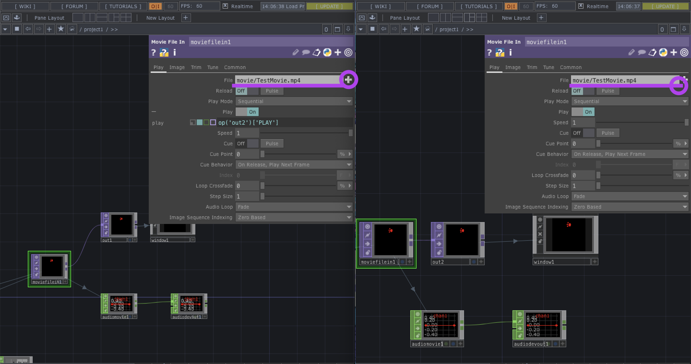
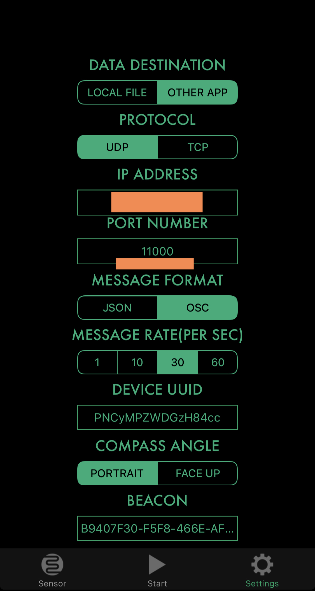
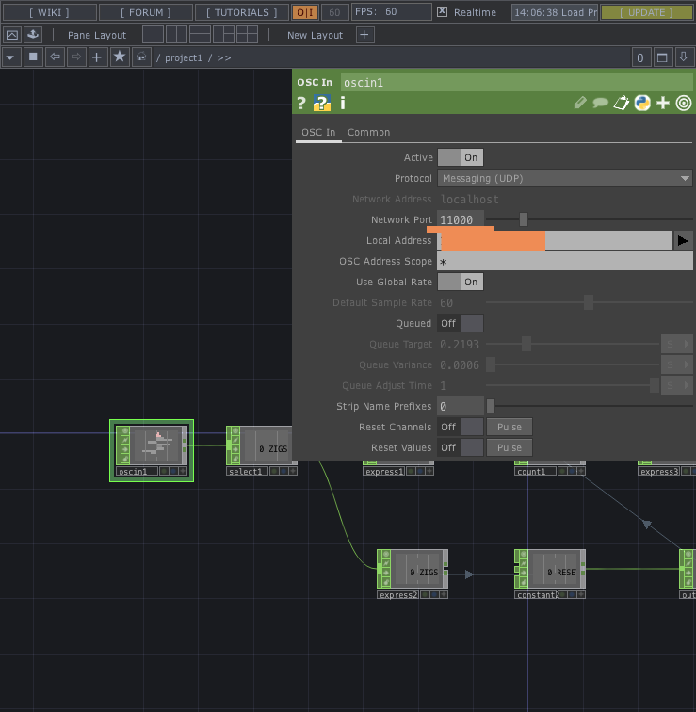
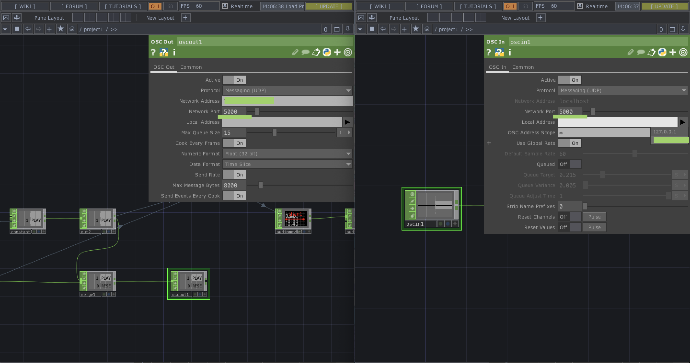

# SyncAndPlay
TouchDesignerでの動画同時再生プログラム  
異なるPCで同時に動画再生をOSC通信を用いてスマホで操作

## SETUP

1. [TouchDesigner](https://derivative.ca/)をPCにダウンロード　　

2. [ZigSim](https://apps.apple.com/jp/app/zig-sim/id1112909974)をスマホにインストール　　

3. 2台のPCとスマホを同じwifiに繋げる  

4. Movie File In nodeで用意した動画を指定　　

5. computer1のOSC In nodeを開き、IPアドレスとPORT番号(オレンジ)を指定  
IPアドレスは右の三角マークを押すと候補から選択可能  
その後、ZigSimのSettings画面に同じIPアドレスとPORT番号(オレンジ)を入力  

 

6. computer2のOSC In nodeを開き、IPアドレスとPORT番号(緑)を指定  
その後、computer1のOSC Out nodeを開き、同じIPアドレスとPORT番号(緑)を入力  

## 使い方
ZigSimのSensor画面から"2D TOUCH"を選択  
その後、Start画面を選択  

- 動画再生→**３本指**でタッチ  
- 動画リロード→**２本指**でタッチ
